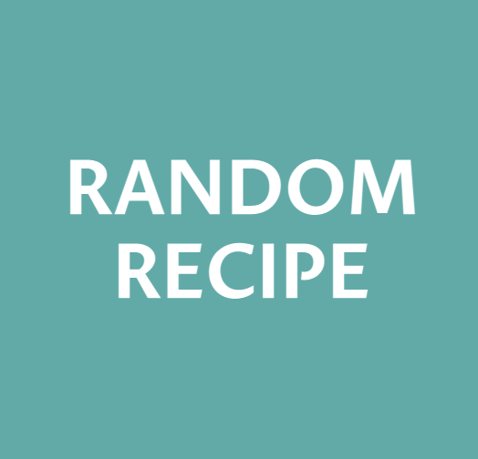

<h1 align="center">Random Recipe</h1>

<strong>Let me know what you have in your fridge, We will find some recipe for you.</strong>

 

<h2>About</h2>
Single page web application built with vanilla JS, SASS, and RESTful API

<h2>Purpose</h2>

This application will provide a container where user can save lists of ingredients they have, and It will recomment a recipe randomly based on what user can cook with.

<h2>Key feature</h2>

- Main Page 
- Recipe display

<h2>Main Page </h2>

