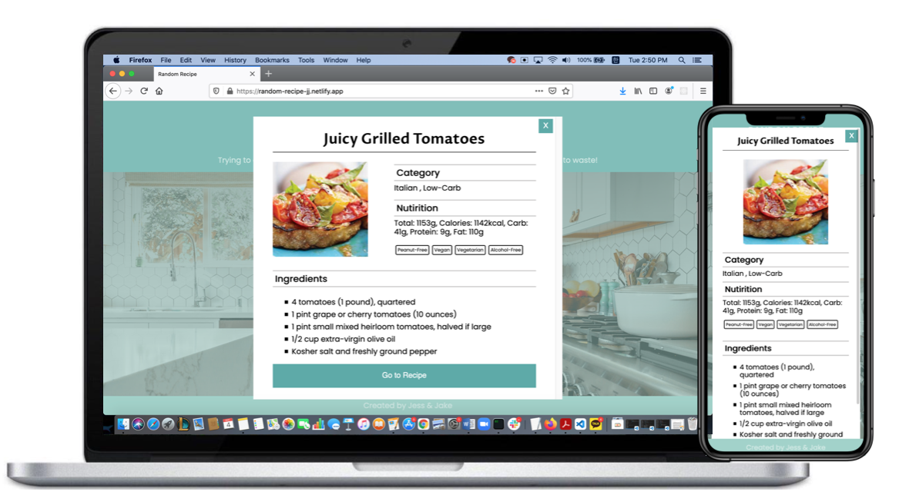

<h1 align="center">Random Recipe</h1>

<strong>Let me know what you have in your fridge, We will find some recipe for you.</strong>

 

<h2>About</h2>
Single page web application built with vanilla JS, SASS, and RESTful API. 
LIVE DEMO :https://random-recipe-jj.netlify.app/
 

<h2>Purpose</h2>
This application will provide a container where user can save lists of ingredients they have, and It will recomment a recipe randomly based on what user can cook with.
 

<h2>Key feature</h2>
<ul>
<li>Main Page</li>
<li>Recipe display</li>
</ul>

 

<h2>Main Page </h2>

1. Users can type their ingredients in input box to save them into the container below.

2. The container shows what users typed as their resouces to cook.

3. 'Clear All' button: It will clear all the ingredients in the container.

4. 'Random Recipe' button: It will display recipe display pop up page.

<h2>Results Page </h2>

Display-page will show users information like below 

<ul>
<li> Menu name</li>
<li> Category of the dish</li>
<li> Nutritions</li>
<li> Food alert / diet info</li>
<li> Name and quatity of ingredients user need to cook the menu</li>
</ul>
 
<h2>Features to be added in the future</h2>

A function that allows users share their ingredients with other people.

People who have right ingredients can gather and cook some foods together.

<h2>Copyright</h2>
This project is licensed under the terms of the MIT license and protected by Udacity Honor Code and Community Code of Conduct. See <a href="LICENSE.md">license</a> and <a href="LICENSE.DISCLAIMER.md">disclaimer</a>